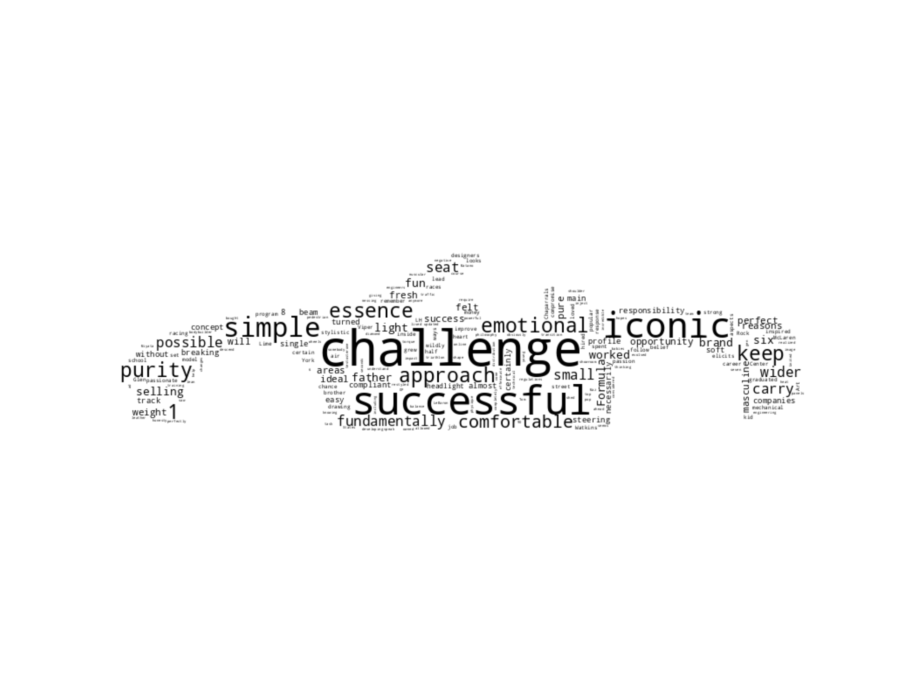

# WordCloud_Miata

I wanted to study Savagegeese series about four generations of miata: https://www.youtube.com/playlist?list=PLr-mTF1DFa-uYhVy6flJn83IiqLWgdssr

I downloaded .srt generated from the videos, created svg files with Inkscape of four generations profile cars and used Wordcloud module to put all together.

To change which generation you want to generate:
line 13, edit txt file name with the appropriate one
line 16, change the generation name accordingly

You will find 3 global variables in Miata_Wordcloud.py:
* SUB_FILE_PATH = the path to the subtitle text file from a youtube video
* MASK_IMAGE_PATH = the path to the mask image wordcloud should use to generate a new image
* STOP_WORDS_PATH =  list of words to exclude from the generated worldcloud

result of the script:

example of what you can achieve at the end (using gimp)

